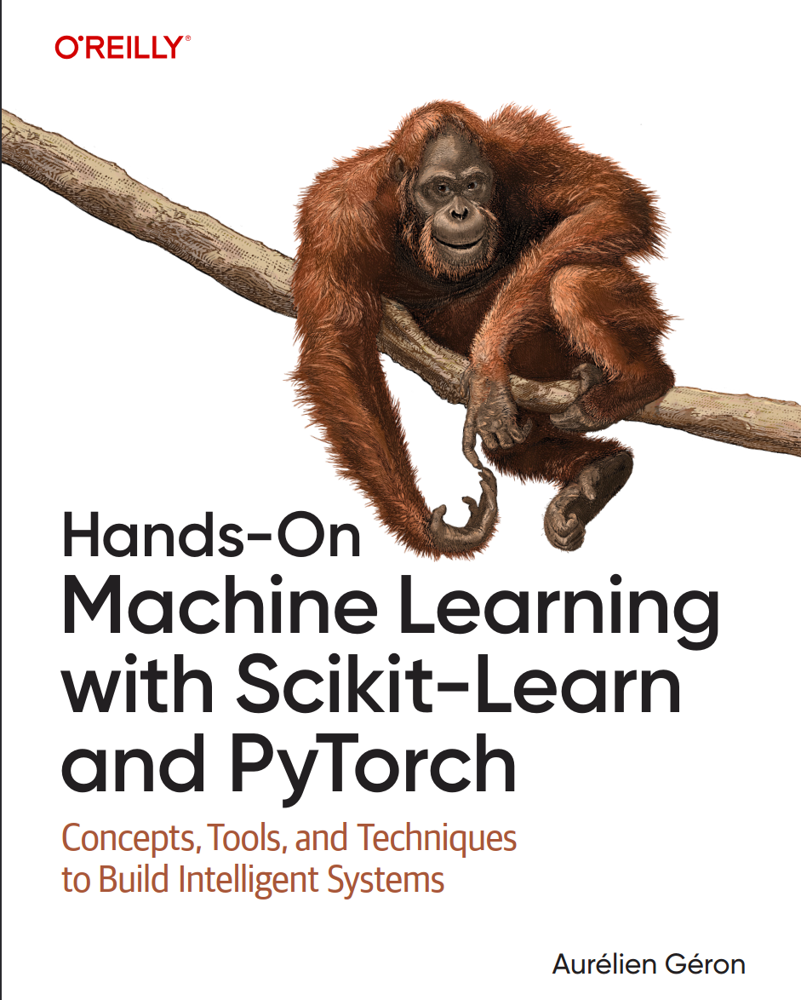

# 🧠 Guía de Estudio: Hands-On Machine Learning
### Análisis y ejercicios del libro de Aurélien Géron (Edición 2025)

*(Esta es una guía de estudio no oficial del libro, todo el material ha sido creado únicamente con fines educativos)*

<p align="center">
  
</p>


<div align="center">
  
  
  
</div>

<div align="center">
  
  
  
</div>

<br>
<br>

> *"La teoría sin práctica es estéril; la práctica sin teoría es ciega."*

<br>


## 👋 ¡Bienvenido al Repositorio!

Este repositorio documenta mi viaje de aprendizaje profundo a través de la **nueva edición (Diciembre 2025)** del libro **"Hands-On Machine Learning with Scikit-Learn and PyTorch"** de *Aurélien Géron*.

Aquí encontrarás **Jupyter Notebooks** detallados, ejercicios resueltos y notas conceptuales de cada capítulo, refactorizados y explicados en español.

---

## 📚 ¿Por qué este libro?

En el mundo de la Ciencia de Datos, este libro es considerado universalmente como la **"Biblia del Machine Learning"**. 

Esta edición 2025 es particularmente especial porque el autor, Aurélien Géron, ha actualizado el contenido para reflejar las demandas actuales de la investigación avanzada y el mercado laboral moderno. No es solo un libro de texto; es el estándar de la industria para entender lo que hay "bajo el capó" de los algoritmos modernos.

### 🚀 El Cambio Estratégico: ¿Por qué PyTorch?
A diferencia de ediciones anteriores centradas en TensorFlow, este repositorio (y la nueva edición del libro) pone un énfasis principal en **PyTorch**.

> **Nota del Autor:** Según las últimas tendencias de la industria y palabras del propio Géron, la mayoría de los *researchers* y las nuevas empresas tecnológicas tienen una marcada predilección por PyTorch debido a su flexibilidad, facilidad de depuración y dominio en el ámbito de la Inteligencia Artificial Generativa.

---

## 📺 Acompañamiento en Video

Este repositorio es el compañero técnico de mi canal de YouTube, donde explico estos conceptos paso a paso. Si prefieres aprender viendo y escuchando, ¡te invito a suscribirte!

[🔴 **Ver la Lista de Reproducción en YouTube: Dominando ML con Aurélien Géron**](https://www.youtube.com/@DataScienceByDoing)

---

## 🗂️ Estructura del Repositorio

El contenido está organizado progresivamente, desde los fundamentos clásicos hasta el Deep Learning avanzado.

### Parte 1: Los Fundamentos del Machine Learning
*Enfocado en Scikit-Learn y limpieza de datos.*
- [X] **Capítulo 1:** El panorama del Machine Learning.
- [ ] **Capítulo 2:** Proyecto de ML de principio a fin (End-to-End).
- [ ] **Capítulo 3:** Clasificación.
- [ ] **Capítulo 4:** Entrenamiento de Modelos.
- [ ] **Capítulo 5:** Support Vector Machines (SVM).
- [ ] **Capítulo 6:** Árboles de Decisión y Ensemble Learning.

### Parte 2: Redes Neuronales y Deep Learning
*La transición moderna hacia PyTorch.*
- [ ] **Capítulo 10:** Introducción a RN con PyTorch.
- [ ] **Capítulo 11:** Entrenamiento de Redes Neuronales Profundas.
- [ ] **Capítulo 12:** Modelos personalizados y entrenamiento con PyTorch.
- [ ] **Capítulo 13:** Carga y preprocesamiento de datos con Tensores.
- [ ] **Capítulo 14:** Visión por Computadora (CNNs).
- [ ] **Capítulo 15:** Procesamiento de Secuencias (RNNs y CNNs).
- [ ] **Capítulo 16:** NLP con Transformers y Atención.

*(La lista se actualizará a medida que avance en el estudio).*

---

## 🛠️ Instalación y Requisitos

Para correr estos notebooks en tu máquina local, asegúrate de tener un entorno configurado correctamente. Recomiendo usar **Conda** para gestionar las dependencias.

```bash
# Clonar el repositorio
git clone https://github.com/MiltonValleL/hands-on-ml-pytorch-2025.git

# Crear entorno virtual (Recomendado)
conda create -n ml-geron python=3.11
conda activate ml-geron

# Instalar dependencias clave
pip install torch torchvision torchaudio scikit-learn pandas numpy matplotlib
```

---

## 🤝 Conecta conmigo

Si estás estudiando este libro o te interesa el Data Science, ¡conectemos! Estoy documentando mi camino para convertirme en un profesional de talla mundial en Machine Learning.

💼 LinkedIn: [Milton Rodolfo Valle Lora](https://www.linkedin.com/in/miltonvallelora/)

🎥 YouTube: [@DataScienceByDoing](https://www.youtube.com/@DataScienceByDoing)

---

## ⚖️ Créditos y Disclaimer Legal

Este repositorio es una adaptación educativa y comentada basada en la obra:
**"Hands-On Machine Learning with Scikit-Learn and PyTorch"** de *Aurélien Géron*.

* **Código Original:** Los conceptos estructurales del código pertenecen a Aurélien Géron y O'Reilly Media.

* **Aportes de este Repositorio:** La traducción al español, comentarios detallados, explicaciones matemáticas (LaTeX), refactorización pedagógica y notas de estudio son autoría intelectual de **Milton Rodolfo Valle Lora**, licenciados bajo **MIT License**.

Este material se distribuye con fines puramente académicos y de portafolio profesional. 

Se recomienda encarecidamente adquirir el libro oficial para apoyar al autor.

---
